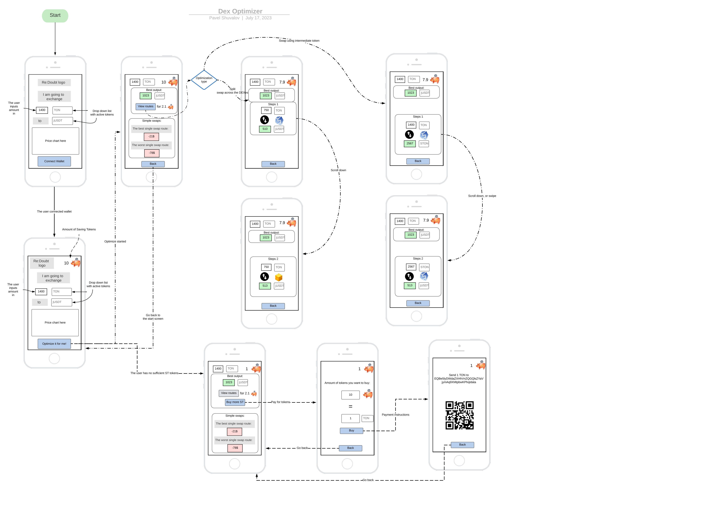
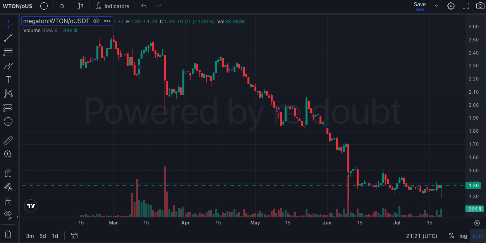

# DEX Optimizer TWA with ChartingView Integration

> **Summary:** TWA interacting with the TON blockchain includes [ChartingView](https://chartingview.co/) integration and allows users swap Jettons 
> in optimized way across DeDust, Ston.fi and Megaton. The main users utility are “special solvers" compete to find the best liquidity source (optimal route) for your trade across mentioned decentralized exchanges. **So the worst price you'll get with us is the best price available elsewhere.**

## [Go to DEX Optimizer TWA](https://t.me/TonDexOptimizerBot)

# Overview

DEX Optimizer is a web-based application that provides a user-friendly interface for interacting with the TON blockchain. TON stands for "Telegram Open Network," and it is a decentralized blockchain platform developed by Telegram, a popular messaging app. TON aims to offer fast and secure transactions, smart contracts, and various other features for its users.

The TWA integrates [ChartingView](https://chartingview.co/), which is a popular charting and technical analysis tool in TON based on [TradingView](https://www.tradingview.com/). This integration allows users to access advanced charting capabilities and perform technical analysis on various assets and tokens available on the TON blockchain. With ChartingView, users can analyze historical price data, identify trends, and make informed decisions when trading or swapping tokens.

One of the primary features of DEX Optimizer is the optimized token swapping functionality. Users can swap Jettons (tokens) across different decentralized finance (DeFi) protocols in a seamless, tailored and efficient manner. Specifically, DEX Optimizer enables users to perform token swaps across three DeFi platforms: DeDust, Ston.fi, and Megaton.

# TWA Architecture

## Smart Solvers (routes optimization)
Route optimization between DEXes, also known as cross-DEX trading or multi-DEX trading, refers to the process of finding the most efficient and cost-effective path to execute a token swap or trade across multiple decentralized exchanges (DEXes). In the TON decentralized finance (DeFi) ecosystem, there are numerous DEXes, each with its liquidity pools and trading pairs.

When a trader wants to perform a token swap between two tokens that are not directly available on the same DEX or there are no enough liquidity with afects on price, they have the option to use route optimization to find the best path to execute the trade. This involves breaking down the trade into multiple smaller trades across different DEXes to achieve the desired swap.

The route optimization algorithm considers various factors, including liquidity, trading fees, and slippage, to determine the optimal sequence of trades across DEXes. By splitting the trade and selecting the most liquid and cost-efficient trading pairs at each step, traders can minimize price impact and obtain the best possible price for their token swap.

## ChartingView Integration

[ChartingView](https://chartingview.co/) allows you to search for a specific ticker (symbol) in the TON DeFi ecosystem, retrieves incl. OHLCV chart data and subscribe to updates.

# TWA Local Development 

## Prerequesities
* Node.js v16 (other versions may work, needs more testing)* A TON Connect 2 compatible wallet

### What does this repo contain?
* A react-based TWA-ready app, interacting with TON and ChartingView 
* Github actions set to deploy app to github pages
* A script to connect a telegram bot to the deployed app

#### How to use
1. Create a template from this repo with the "Use this template" button
2. Clone this repo and run `yarn`

3. Create a new bot with [botfather](https://t.me/botfather)
   1. Type `/newbot`
   2. Choose a name for your bot, e.g. `My Ton TWA`
   3. Choose a username for your bot, e.g. `my_ton_twa_482765_bot`
   4. Take note of the access token, e.g. `5712441624:AAHmiHvwrrju1F3h29rlVOZLRLnv-B8ZZZ`
   5. Run `yarn configbot` to link your bot to the webapp

### Development
1. Run `npm run dev` and edit the code as needed
2. On push to the `main` branch, the app will be automatically deployed via github actions.

#

